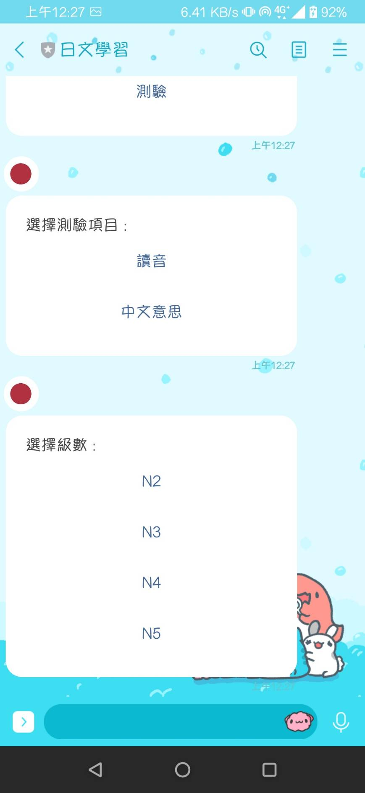
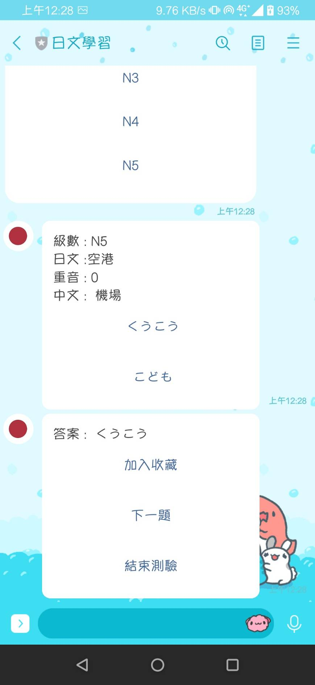

# TOC Project 2020
<p>
    <a target="_blank" href="#" title="top language"></a>
</p>

## Introduction

A Japanese learning Line bot based on a finite state machine

## Function

### Start
After sending `start` to the Line bot, `Main menu` will be returned
<p align=center>

</p>

### Vocabulary learning
For the first four options in `Main menu`, you can choose which level you want, and bot will return five words of the level.(below shows the result of choosing `N5單字`)
<p align=center>

</p>

You can choose to go back to `Main menu` or continue to see words at the end of the message 
<p align=center>

</p>

You can add the word to favorite by clicking `加入收藏`. If the word is not in the favorite, bot will send `已將單字加入收藏` and add it to favorite, else return `單字已在收藏`
<p align=center>

</p>

### See favorite
You can see your favorite words by clicking `我的收藏`, bot will return at most five words in your favorite.
<p align=center>

</p>

If you want to remove the word, just click `移除收藏` below the word. If success, bot will return `已將單字移除收藏`.
<p align=center>

</p>

### Test
You can test by clicking `測驗`, bot will reply two options, first one represents that you need to answer the spell of the word, second one represents that you need to answer the chinese meaning of the word.
<p align=center>

</p>

After choosing the type of test, you need to choose the level.
<p align=center>

</p>

#### Spell test
After choosing level, you can start to test, below shows the spell test.
<p align=center>

</p>

After answering, bot will return the answer, and then you can choose to add word to favorite, continue , or go back to `Main menu`.
<p align=center>

</p>

#### Chinese meaning test
After choosing level, you can start to test, below shows the chinese meaning test.
<p align=center>

</p>

After answering, bot will return the answer, and then you can choose to add word to favorite, continue , or go back to `Main menu`.
<p align=center>

</p>

## Usage
The initial state is set to `user`.

Every `state` can be triggered to `advance` to another `state` or `go_back` to the `state` which triggered it before.

## Create word file
You need to create four files(`N2.csv`,`N3.csv`,`N4.csv`,`N5.csv`) below the `data` directory.  
In every row of file, you have to follow the rules below(there is also an example under data directory.)  
1. Japan original word   
	<table>
	<tr>
		<td>Japanese</td>
		<td>spell</td>
		<td>tune</td>
		<td>meaning</td>
	</tr>
	</table>
2. loanword
	<table>
	<tr>
		<td>spell</td>
		<td>------</td>
		<td>tune</td>
		<td>meaning</td>
	</tr>
	</table>

## Deploy(This part is copied from https://github.com/NCKU-CCS/TOC-Project-2020)
Setting to deploy webhooks on Heroku.

### Heroku CLI installation

* [macOS, Windows](https://devcenter.heroku.com/articles/heroku-cli)

or you can use Homebrew (MAC)
```sh
brew tap heroku/brew && brew install heroku
```

or you can use Snap (Ubuntu 16+)
```sh
sudo snap install --classic heroku
```

### Connect to Heroku

1. Register Heroku: https://signup.heroku.com

2. Create Heroku project from website

3. CLI Login

	`heroku login`

### Upload project to Heroku

1. Add local project to Heroku project
	```
	heroku git:remote -a {HEROKU_APP_NAME}
	```
2. Use database service provided by heroku
	```sh
	heroku addons:create heroku-postgresql:hobby-dev
	```
	After add database service, you can connect database to pgAdmin 4 by follwing the steps of this [website](https://learningsky.io/database-pgadmin-postgresql-heroku/)

3. Upload project

	```
	git add .
	git commit -m "Add code"
	git push -f heroku master
	```

4. Set Environment - Line Messaging API Secret Keys

	```
	heroku config:set LINE_CHANNEL_SECRET=your_line_channel_secret
	heroku config:set LINE_CHANNEL_ACCESS_TOKEN=your_line_channel_access_token
	```

5. Your Project is now running on Heroku!

	url: `{HEROKU_APP_NAME}.herokuapp.com/webhook`

	debug command: `heroku logs --tail --app {HEROKU_APP_NAME}`


6. If fail with `pygraphviz` install errors

	run commands below can solve the problems
	```
	heroku buildpacks:set heroku/python
	heroku buildpacks:add --index 1 heroku-community/apt
	```

	refference: https://hackmd.io/@ccw/B1Xw7E8kN?type=view#Q2-如何在-Heroku-使用-pygraphviz


## Finite State Machine
below shows the finite state machine of nihongolearning


## Reference


[TOC-Project-2019](https://github.com/winonecheng/TOC-Project-2019) ❤️ [@winonecheng](https://github.com/winonecheng)

Flask Architecture ❤️ [@Sirius207](https://github.com/Sirius207)

[Line line-bot-sdk-python](https://github.com/line/line-bot-sdk-python/tree/master/examples/flask-echo)
